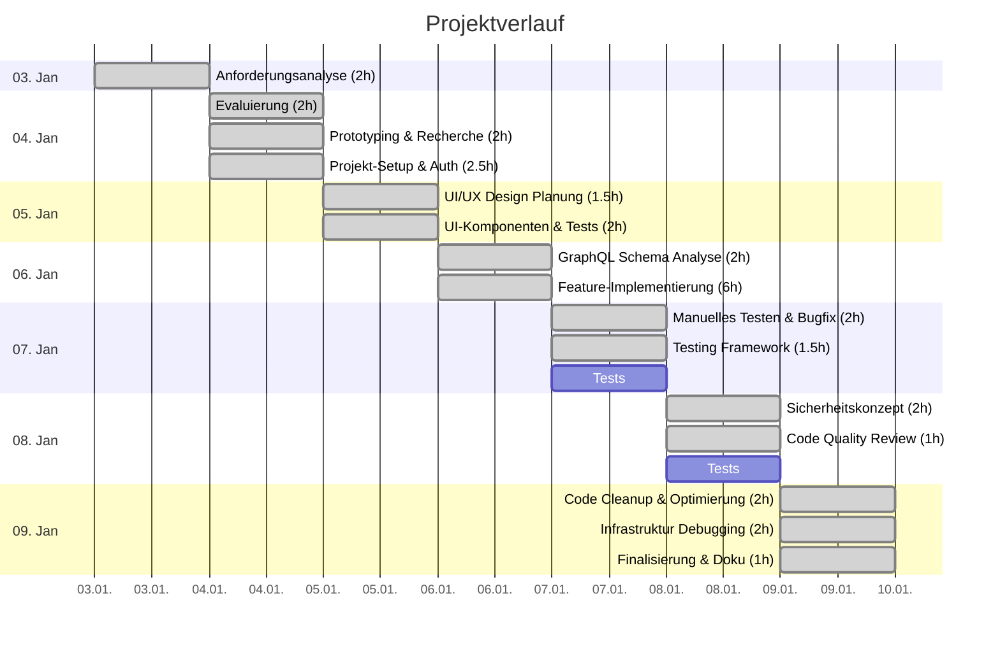

# Projektplan Visualisierung Abgabe 3 
Nick Rusnak - runi1015

```mermaid
gantt
    title Projektverlauf
    dateFormat  YYYY-MM-DD
    axisFormat  %d.%m.
    
    section 03. Jan
    Anforderungsanalyse (2h)           :done, 2026-01-03, 1d
    
    section 04. Jan
    Evaluierung (2h)                   :done, 2026-01-04, 1d
    Prototyping & Recherche (2h)       :done, 2026-01-04, 1d
    Projekt-Setup & Auth (2.5h)        :done, 2026-01-04, 1d

    section 05. Jan
    UI/UX Design Planung (1.5h)        :done, 2026-01-05, 1d
    UI-Komponenten & Tests (2h)        :done, 2026-01-05, 1d

    section 06. Jan
    GraphQL Schema Analyse (2h)        :done, 2026-01-06, 1d
    Feature-Implementierung (6h)       :done, 2026-01-06, 1d

    section 07. Jan
    Manuelles Testen & Bugfix (2h)     :done, 2026-01-07, 1d
    Testing Framework (1.5h)           :done, 2026-01-07, 1d
    Tests: Setup & Basic E2E (1h)      :done, 2026-01-07, 1d
    
    section 08. Jan
    Sicherheitskonzept (2h)            :done, 2026-01-08, 1d
    Code Quality Review (1h)           :done, 2026-01-08, 1d
    Tests: Refactoring & Fixtures (2h) :done, 2026-01-08, 1d
    
    section 09. Jan
    Code Cleanup & Optimierung (2h)    :done, 2026-01-09, 1d
    Infrastruktur Debugging (2h)       :done, 2026-01-09, 1d
    Finalisierung & Doku (1h)          :done, 2026-01-09, 1d
```

## Zusammenfassung
- **Gesamtaufwand:** 34 Stunden
- **Zeitraum:** 03.01.2026 - 09.01.2026
