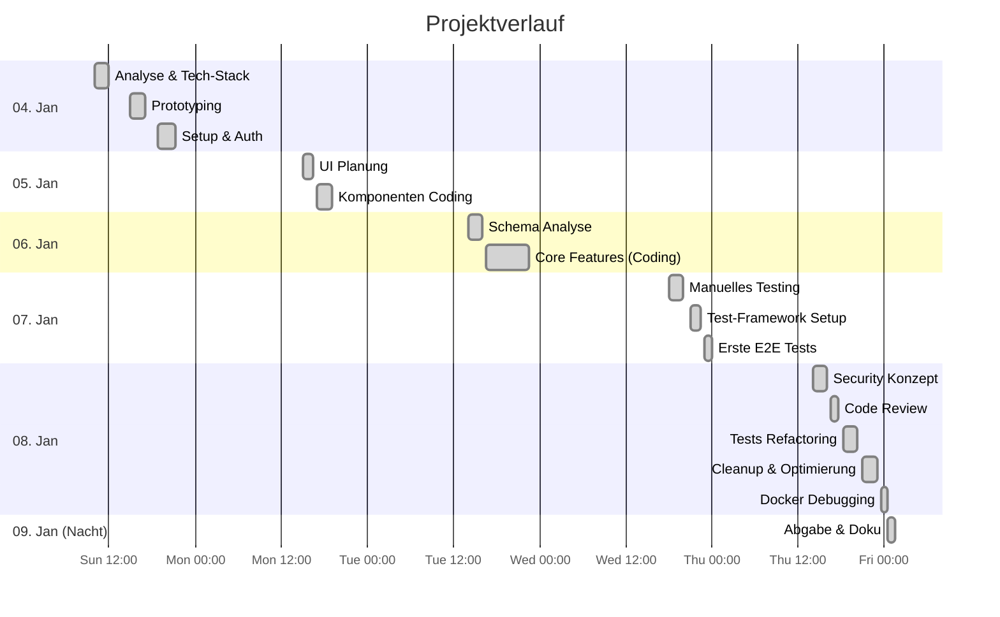

# Projektplan Visualisierung Abgabe 3 
Nick Rusnak - runi1015

```mermaid
gantt
    title Projektverlauf
    dateFormat  YYYY-MM-DD HH:mm
    axisFormat  %a %H:00
    
    section 04. Jan
    Analyse & Tech-Stack      :done, 2026-01-04 10:00, 2h
    Prototyping               :done, 2026-01-04 15:00, 2h
    Setup & Auth              :done, 2026-01-04 18:45, 2.5h
    
    section 05. Jan
    UI Planung                :done, 2026-01-05 15:00, 1.5h
    Komponenten Coding        :done, 2026-01-05 17:00, 2h

    section 06. Jan
    Schema Analyse            :done, 2026-01-06 14:00, 2h
    Core Features (Coding)    :done, 2026-01-06 16:30, 6h

    section 07. Jan
    Manuelles Testing         :done, 2026-01-07 18:00, 2h
    Test-Framework Setup      :done, 2026-01-07 21:00, 1.5h
    Erste E2E Tests           :done, 2026-01-07 23:00, 1h
    
    section 08. Jan
    Security Konzept          :done, 2026-01-08 14:00, 2h
    Code Review               :done, 2026-01-08 16:30, 1h
    Tests Refactoring         :done, 2026-01-08 18:15, 2h
    Cleanup & Optimierung     :done, 2026-01-08 21:00, 2h
    Docker Debugging          :done, 2026-01-08 23:30, 1h
    
    section 09. Jan (Nacht)
    Abgabe & Doku             :done, 2026-01-09 00:30, 1h
```
